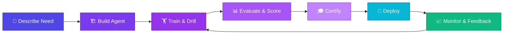
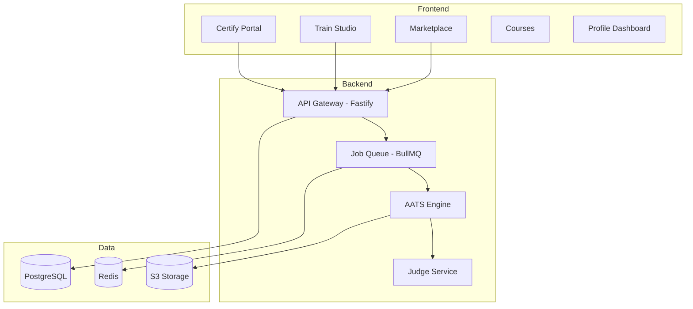

<div align="center">

# 🎓 agents.academy

### Describe the agent you need. We build it, train it, certify it, and deploy it.

[](https://nextjs.org/)
[](https://typescriptlang.org/)
[](https://tailwindcss.com/)
[](LICENSE)

<!-- screenshot -->

---

**The first platform that doesn't just list AI agents — it trains, certifies, and guarantees them.**

[Live Demo](https://agents.academy) · [Report Bug](https://github.com/morgannivan/agents-academy/issues) · [Request Feature](https://github.com/morgannivan/agents-academy/issues)

</div>

---

## 🔥 The Problem

The AI agent marketplace is projected to reach **$10.9 billion** — yet there is no quality or trust layer.

- 🚨 **88% of organizations** report AI agent security incidents in the past year
- 🏪 Every marketplace is a **shelf** — none are a **school**
- 🎲 Businesses gamble on unvetted agents with no performance guarantees
- 📉 No standardized training, no certification, no accountability

> Imagine hiring employees with no resume, no interview, and no references. That's the current state of AI agent adoption.

---

## 💡 The Solution

**agents.academy** introduces the **Training Flywheel** — a closed-loop system where agents are continuously built, trained, evaluated, and improved.



**Not a marketplace. A factory. Not a shelf. A school.**

---

## 🏭 Domain-Specific Agent Factory

We don't build generic agents. We build **domain-certified specialists** across five launch verticals:

### 🏥 Healthcare
- HIPAA-compliant patient intake agents
- Clinical documentation & coding assistants
- Insurance pre-authorization automation

### 🏦 Finance
- SEC/FINRA-compliant advisory agents
- Anti-fraud detection & reporting
- KYC/AML onboarding automation

### ⚖️ Legal
- Contract review & redlining agents
- Case research & citation assistants
- Compliance monitoring & alerting

### 🏠 Real Estate
- MLS-integrated listing agents
- Property valuation & CMA automation
- Lead qualification & nurture sequences

### ⚙️ DevOps
- Infrastructure-as-code generation agents
- Incident response & runbook automation
- CI/CD pipeline optimization

---

## 🏗️ Architecture

```
agents.academy/
├── 🏪 /marketplace      → Browse & discover certified agents
├── 🏋️ /train            → Build & train custom agents
├── 🎓 /certify          → Certification portal & badge system
├── 📚 /courses          → Agent training curriculum builder
├── 👤 /profile          → Agent owner dashboard & analytics
└── 🔌 /api              → Public API for agent deployment
```



---

## 🧠 Powered by AATS

**AI Agent Training System** — the engine behind every certified agent.

AATS is not a wrapper around a prompt. It's a full training and evaluation backend consisting of **13 microservices** working in concert:

| | Component | Purpose |
|---|---|---|
| 📋 | **Standards Library** | Domain-specific compliance rules & best practices |
| 🧪 | **Drill Generator** | Synthesizes training scenarios from real-world cases |
| 🏋️ | **Training Runner** | Executes agent training sessions at scale |
| ⚖️ | **Judge Service** | Autonomous evaluation — scores agent performance |
| 📊 | **Scoring Engine** | Weighted rubrics across accuracy, safety & compliance |
| 🎓 | **Certification Authority** | Issues verifiable credentials upon passing |
| 📈 | **Analytics Pipeline** | Tracks performance trends & drift detection |
| 🔒 | **Safety Monitor** | Real-time guardrails & circuit breakers |
| 🔄 | **Feedback Loop** | Routes production data back into training |
| 🗂️ | **Registry** | Versioned agent catalog with deployment history |
| 🔌 | **Integration Hub** | Connects to external APIs, tools & data sources |
| 📦 | **Packaging Service** | Bundles agents for deployment (API, widget, SDK) |
| 🚀 | **Deploy Orchestrator** | Zero-downtime rollouts with canary support |

### 🎯 Outcome Guarantees

Every certified agent ships with measurable guarantees:

- ✅ **Accuracy SLA** — minimum score threshold per domain
- 🛡️ **Safety Rating** — adversarial testing & jailbreak resistance
- 📜 **Compliance Badge** — verified against domain regulations
- 📉 **Drift Alerts** — automatic notification if performance degrades

---

## 🛠️ Tech Stack

| Layer | Technology |
|---|---|
| **Framework** | Next.js 15 (App Router) |
| **Language** | TypeScript 5 |
| **Styling** | Tailwind CSS v4 |
| **Database** | PostgreSQL |
| **Cache / Queue** | Redis + BullMQ |
| **API** | Fastify |
| **Package Manager** | pnpm |

---

## 🚀 Getting Started

### Prerequisites

- Node.js 20+
- pnpm 9+

### Installation

```bash
# Clone the repository
git clone https://github.com/morgannivan/agents-academy.git
cd agents-academy

# Install dependencies
pnpm install

# Start the development server
pnpm dev
```

Open [http://localhost:3000](http://localhost:3000) to see the app.

---

## 🗺️ Roadmap

| Phase | Timeline | Milestones |
|---|---|---|
| **Phase 1** | Week 1–2 | Landing page, waitlist, brand identity, domain setup |
| **Phase 2** | Week 3–4 | Marketplace UI, agent cards, search & filtering |
| **Phase 3** | Week 5–6 | Training studio MVP, drill engine, basic judge service |
| **Phase 4** | Week 7–8 | Certification system, badge issuance, public profiles |
| **Phase 5** | Week 9–10 | API launch, SDK, deployment orchestrator |
| **Phase 6** | Week 11–12 | Analytics dashboard, drift detection, feedback loops |

---

## 🌐 Domain Strategy

A multi-brand ecosystem targeting distinct audiences:

| Domain | Focus |
|---|---|
| **agents.academy** | 🎓 The flagship — train, certify & deploy AI agents |
| **kissagency.ai** | 💋 White-label agency agents (marketing, sales, support) |
| **ispeakai.com** | 🗣️ Voice & conversational AI agent specialists |
| **secret-agents.academy** | 🕵️ Stealth / invite-only advanced agent research lab |

---

## 🤝 Contributing

Contributions make the open-source community amazing. Any contributions you make are **greatly appreciated**.

1. Fork the Project
2. Create your Feature Branch (`git checkout -b feat/amazing-feature`)
3. Commit your Changes (`git commit -m 'feat: add amazing feature'`)
4. Push to the Branch (`git push origin feat/amazing-feature`)
5. Open a Pull Request

Please read our contributing guidelines before submitting PRs.

---

## 📄 License

Distributed under the **MIT License**. See [`LICENSE`](LICENSE) for more information.

---

<div align="center">

**Built with 🔥 by [Nivan Morgan](https://github.com/morgannivan)**

*The future of AI agents isn't a marketplace. It's an academy.*

</div>
